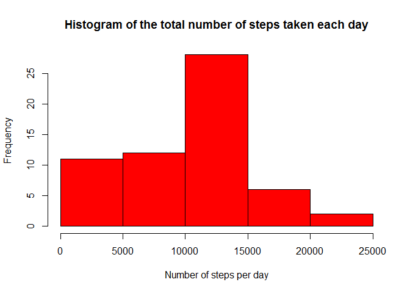
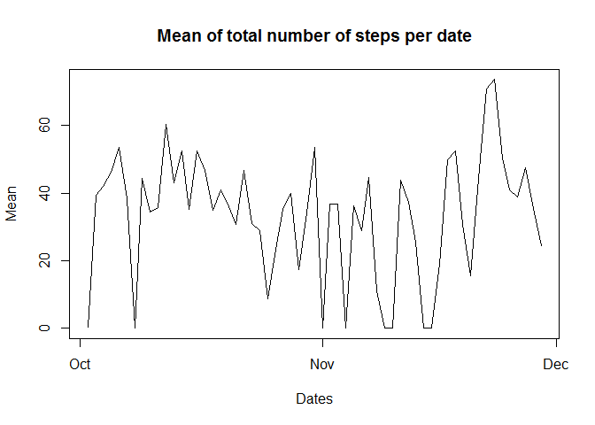
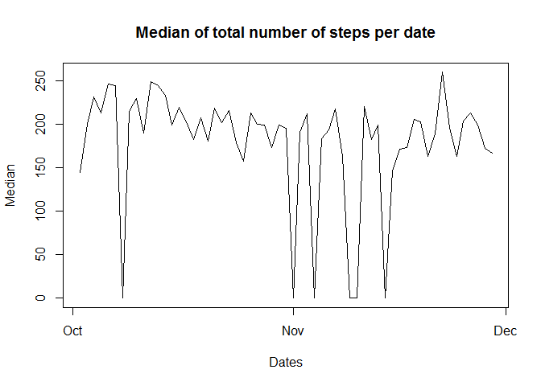
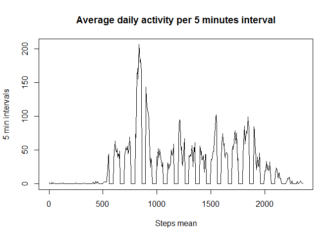
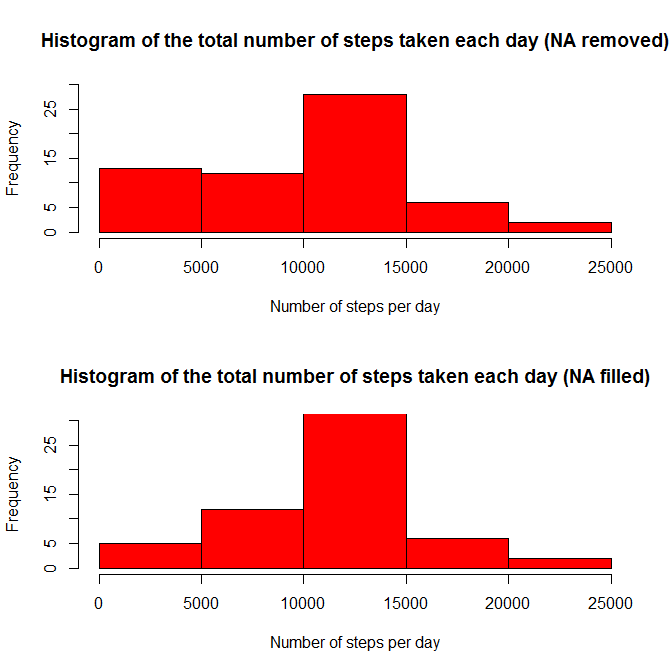
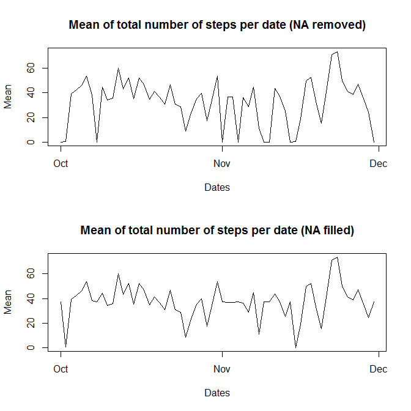
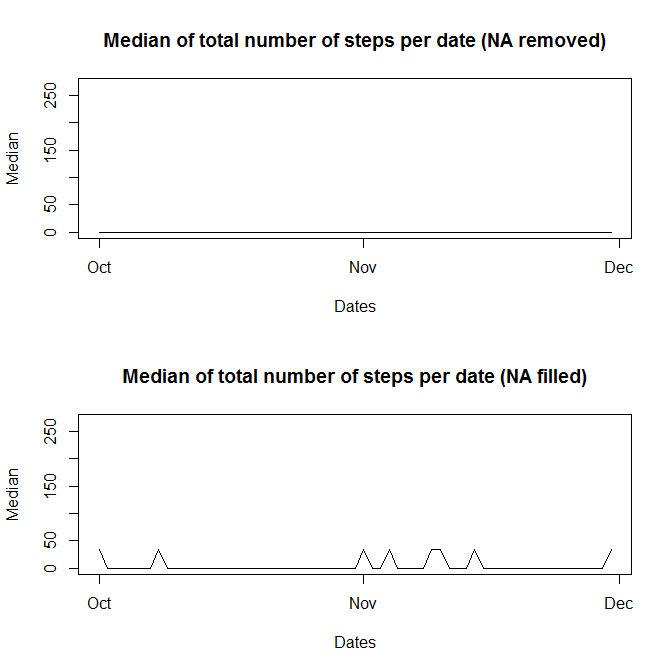
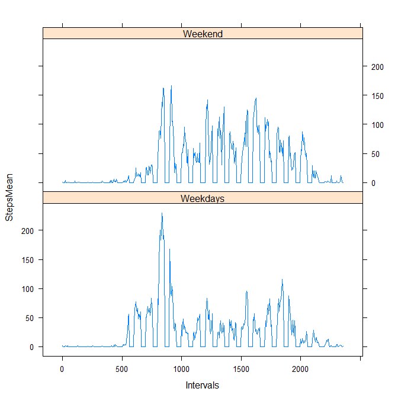

# Reproducible Research: Peer Assessment 1

## Introduction

It is now possible to collect a large amount of data about personal movement using activity monitoring devices such as a Fitbit, Nike Fuelband, or Jawbone Up. These type of devices are part of the "quantified self" movement - a group of enthusiasts who take measurements about themselves regularly to improve their health, to find patterns in their behavior, or because they are tech geeks. But these data remain under-utilized both because the raw data are hard to obtain and there is a lack of statistical methods and software for processing and interpreting the data.

This assignment makes use of data from a personal activity monitoring device. This device collects data at 5 minute intervals through out the day. The data consists of two months of data from an anonymous individual collected during the months of October and November, 2012 and include the number of steps taken in 5 minute intervals each day.

## Data

The data used on this assignment can be downloaded from the course web site:

Dataset: Activity monitoring data [52K] (https://d396qusza40orc.cloudfront.net/repdata%2Fdata%2Factivity.zip)
The variables included in this dataset are:

- steps: Number of steps taking in a 5-minute interval (missing values are coded as NA)

- date: The date on which the measurement was taken in YYYY-MM-DD format

- interval: Identifier for the 5-minute interval in which measurement was taken

The dataset is stored in a comma-separated-value (CSV) file and there are a total of 17,568 observations in this dataset.

## Loading and preprocessing the data

The "lubridate" and "dplyr" packages are loaded:

```r
  library(lubridate)
  library(dplyr)
```
The data is read into the stepsActivity data.frame, the date is given format and the missing values are removed:

```r
  stepsActivity <- read.csv("activity.csv")
  stepsActivity$date <- ymd(stepsActivity$date)
  stepsActivity <- na.omit(stepsActivity)
```


## What is mean total number of steps taken per day?

In this part the missing values were ignored.


```r
    allDates <- seq(from = min(steps$date), to = max(steps$date), by = "day")
  
  stepsPerDate <- as.data.frame(allDates, row.names(c("Dates", "Steps")))
  stepcount <- c()
  stepMean <- c()
  stepMedian <- c()
  for(day in allDates)
  {
    temp <- filter(steps, date == day) %>% select(steps) %>% arrange()
    temp2 <- order(temp$steps, decreasing = F)
    if(length(temp$steps) > 0)
    {
      stepcount <- c(stepcount, sum(temp$steps, na.rm = T))
      stepMean <- c(stepMean, mean(temp$steps, na.rm = T))
      stepMedian <- c(stepMedian, myMedian(temp2))
    }
    else
    {
      stepcount <- c(stepcount, 0)
      stepMean <- c(stepMean, 0)
      stepMedian <- c(stepMedian, 0)
    }
  }
  
  stepsPerDate <- mutate(stepsPerDate, Dates = allDates)
  stepsPerDate <- mutate(stepsPerDate, Steps = stepcount)
  stepsPerDate <- mutate(stepsPerDate, Mean = stepMean)
  stepsPerDate <- mutate(stepsPerDate, Median = stepMedian)
  
  
  hist(stepsPerDate$Steps
       , col = "red"
       , main = "Histogram of the total number of steps taken each day"
       , xlab = "Number of steps per day")
  plot(stepsPerDate$Dates
       , stepsPerDate$Mean
       , type = "l"
       , main = "Mean of total number of steps per date"
       , xlab = "Dates"
       , ylab = "Mean")
  plot(stepsPerDate$Dates
       , stepsPerDate$Median
       , type = "l"
       , main = "Median of total number of steps per date"
       , xlab = "Dates"
       , ylab = "Median")
```

   

As shown, for each date, values for the total number of steps, mean and median were calculated.


## What is the average daily activity pattern?

Now for this part we get the 5-minute interval with with maximun number of steps:


```r
  #interval with maximun average of steps
  maxActivityInterval <- filter(stepsPerInterval, StepsMean == max(StepsMean))
  print(maxActivityInterval)
  plot(stepsPerInterval$Intervals
       , stepsPerInterval$StepsMean
       , type = "l"
       , main = "Average daily activity per 5 minutes interval"
       , xlab = "Steps mean"
       , ylab = "5 min intervals")
```


```
##   Intervals StepsMean
## 1       835  206.1698
```

 

## Imputing missing values

Here the number of missing values in the data set is reported. Since the presence of missing days may cause bias into calculations and summaries of the data a strategy for filling them is applied. This strategy consists on replacing the missing values with the average obtained for that specific interval across all days (Show in the code below). After that, a new data set with the missing values is created and the plots for reporting the total number of steps, mean and median are shown.


```r
  #segment of code to replace missing values with the mean of each 5-minutes interval
  Intervals <- seq(from = min(stepsNoNA$interval), to = max(stepsNoNA$interval), by = 5)
  stepsPerInterval <- as.data.frame(Intervals, row.names(c("Intervals")))
  
  stepMean <- c()
  
  for(i in Intervals)
  {
    temp <- filter(stepsNoNA, interval == i) %>% select(steps) 
    if(length(temp$steps) > 0)
    {
      stepMean <- c(stepMean, mean(temp$steps, na.rm = T))
    }
    else
    {
      stepMean <- c(stepMean, 0)
    }
  }
  #replace NA values with mean for the corresponding interval
  for(i in 1:length(steps$steps))
  {
    if(is.na(steps$steps[i]))
    {
      intervalMean <- filter(stepsPerInterval, Intervals == stepsActivity$interval[i])
      stepsActivity$steps[i] <- intervalMean$StepsMean
    }
  }
```


```r
  #number of missing values
  missingValues <- filter(steps, is.na(steps))
  print("Nmber of missing values (NA):")
  print(length(missingValues$steps))
  par(mfrow = c(2,1))
  hist(stepsPerDate_NoNA$Steps
       , col = "red"
       , main = "Histogram of the total number of steps taken each day (NA removed)"
       , xlab = "Number of steps per day"
       , ylim = c(0,30))
  
  hist(stepsPerDate$Steps
       , col = "red"
       , main = "Histogram of the total number of steps taken each day (NA filled)"
       , xlab = "Number of steps per day"
       , ylim = c(0,30))
  par(mfrow = c(2,1))
   plot(stepsPerDate_NoNA$Dates, stepsPerDate_NoNA$Mean
        , type = "l"       
        , main = "Mean of total number of steps per date (NA removed)"
        , xlab = "Dates"
        , ylab = "Mean")
   plot(stepsPerDate$Dates, stepsPerDate$Mean
        , type = "l"       
        , main = "Mean of total number of steps per date (NA filled)"
        , xlab = "Dates"
        , ylab = "Mean")
   par(mfrow = c(2,1))
   plot(stepsPerDate_NoNA$Dates, stepsPerDate_NoNA$Median
        , type = "l"
        , main = "Median of total number of steps per date (NA removed)"
        , xlab = "Dates"
        , ylab = "Median"
        , ylim = c(0,270))
   plot(stepsPerDate$Dates, stepsPerDate$Median
        , type = "l"
        , main = "Median of total number of steps per date (NA filled)"
        , xlab = "Dates"
        , ylab = "Median"
        , ylim = c(0,270))
```


```
## [1] "Number of missing values (NA):"
## [1] 2304
```

   

As seen on the plots, comparing the results before and after filling the missing values in the data set, the values for number of steps, mean and median are different, the frequency of low values for the total number of steps is lower and it seems more accurate to calculate the mean and median, but this may depend on other variables not taken in consideration in the strategy used to fill the missing values, like the activity patterns for those days or time intervals where the missing values were replaced.

## Are there differences in activity patterns between weekdays and weekends?

For this last part a factor variable is added to the dataset with the filled-in missing values, this new variable indicates if the gven date is a weekday or a weekend day. A plot containing a time series of the 5-minutes interval and the average number of steps taken across all weekdays or weekends is shown:


```r
  #Adding new factor variable isWeekday
  stepsActivity <- mutate(stepsActivity, Weekday = weekdays(date))
  stepsActivity <- mutate(stepsActivity, isWeekday = "Weekday")
  
  for(i in 1:length(steps$Weekday))
  {
    if(stepsActivity$Weekday[i] == "Saturday" || stepsActivity$Weekday[i] == "Sunday")
    {
      stepsActivity$isWeekday[i] <- "Weekend"
    }
  }
  
  stepsActivity <- select(stepsActivity, -Weekday)
  
  WeekendDays <- filter(stepsActivity, isWeekday == "Weekend")
  WeekdayDays <- filter(stepsActivity, isWeekday == "Weekday")
  
  #...
  WeekdaysAndweekends <- rbind(Weekend_stepsPerInterval, Weekdays_stepsPerInterval)
  p <- xyplot(StepsMean ~ Intervals | dayType, data = WeekdaysAndweekends, type = "l", layout = c(1,2))
  print(p)
```

 

In the previous plot the activity for the weekend days is in overall higher for most of the intervals with the exception of the 500 to 1000 range of intervals where the weekdays show a higher activity.
